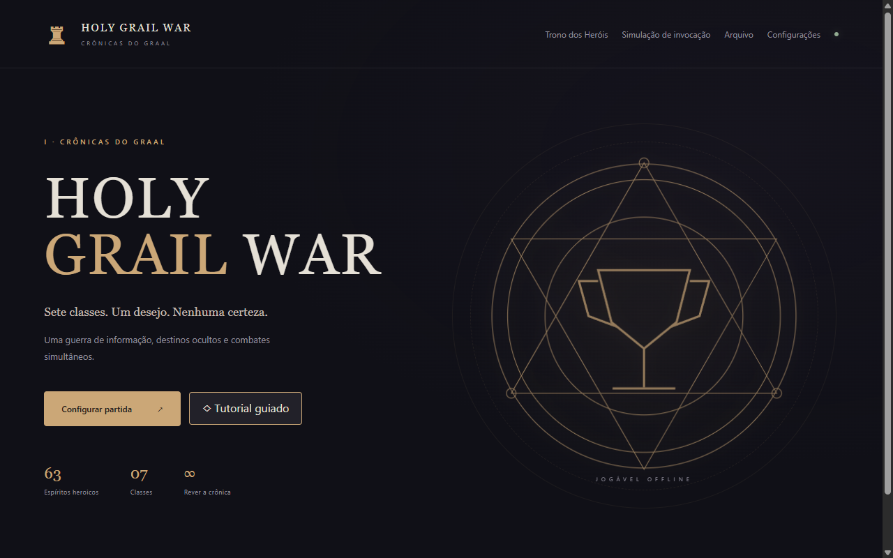
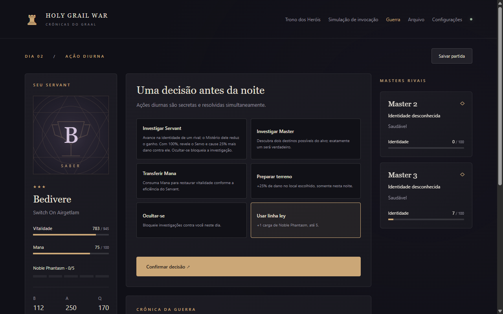
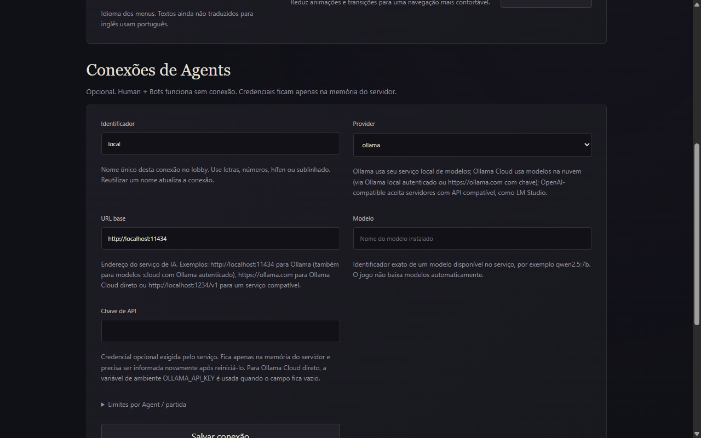

# Masters of the Grail

[Português](README.md) · **English**

A turn-based strategy game with hidden information, built as a lab for comparing three ways of making decisions under the same rules: **human reasoning**, **deterministic Bots** and **LLM-based AI Agents**.



> **Controllers decide. Game Engine resolves.**
> Human, Bot or Agent: every player receives the same partial view of the game and returns an intent. Only the engine knows the real state.

## Why this project exists

LLM benchmarks usually score isolated answers. Here the Agent has to **play**: plan with incomplete information, call tools, keep memory across turns, stay within budget and time limits, and produce a valid action at every decision.

The game is designed so that all three minds compete in the same match under identical conditions:

|                | Human                               | Bot                                 | AI Agent                                                        |
| -------------- | ----------------------------------- | ----------------------------------- | --------------------------------------------------------------- |
| How it decides | Intuition, reading rivals, bluffing | Utility AI with per-profile weights | LLM with tools and memory                                       |
| What it sees   | `PlayerView`                        | `PlayerView`                        | `PlayerView`, queried through tools                             |
| Reproducible   | No                                  | Yes: same seed, same decisions      | No, and it has cost and latency                                 |
| When it fails  | Makes a bad move                    | Never fails, but is predictable     | Invalid answer, timeout or exhausted budget: the Bot takes over |

The question the project lets you explore: **does a language model reason better than a deterministic heuristic when the game demands deduction, bluffing and resource management?** And at what cost?

## The game in one minute

Masters summon Servants and fight for the Holy Grail until one remains.

1. **Summoning:** six ritual choices weigh the odds of each of the 63 Servants. The Mana you spend sets the rarity.
2. **Destination:** each Master secretly seals where they will spend the night.
3. **Day action:** investigate a Servant or Master, transfer Mana, prepare terrain, hide, or charge the Noble Phantasm at a leyline.
4. **Night:** destinations are revealed. Everyone at the same location fights, and damage is resolved simultaneously.
5. Buster beats Arts, Arts beats Quick, Quick beats Buster. Learning a rival's true name grants +25% damage against them.

Information is the core resource. Whoever investigates better knows where a rival will be and which fights are worth taking. That makes the game a good reasoning test.

The interface is available in English and Brazilian Portuguese, selectable in Settings.



## AI Agents: how it works

The `AgentRuntime` turns an LLM into a safe, auditable player:

- **Minimal view.** The model receives only its own Master's `PlayerView`. Rivals' private state never reaches the prompt.
- **Query tools.** Instead of acting, the Agent can answer `{"tool": "get_known_enemies"}` and the runtime returns the result. Available tools: `get_my_servant`, `get_my_resources`, `get_known_enemies`, `get_locations` and `get_investigation_results`. Tools only read; they never change state.
- **Custom JSON protocol.** It does not rely on the provider's native tool calling, so it works with any model that can produce JSON.
- **Two-layer validation.** A Zod schema checks structure and the game engine checks legality. Valid JSON is not a valid move.
- **Separate memory.** Verified facts are kept apart from the Agent's own hypotheses, and the Agent can write short notes between turns.
- **Per-Agent budgets.** Limits on calls, tokens, cost, time per decision, retries and tools per decision. Tokens are reserved before each call and reconciled with actual usage.
- **Bot fallback.** A timeout, provider error, invalid answer or exhausted budget makes the Bot decide that turn. The match never stalls.
- **Telemetry.** Latency, tokens, estimated cost, invalid attempts and fallbacks per decision, without leaking credentials.
- **One-call summoning.** All six ritual choices come from a single structured answer.

### Supported providers

| Provider          | Example URL                                                | Notes                                            |
| ----------------- | ---------------------------------------------------------- | ------------------------------------------------ |
| Local Ollama      | `http://127.0.0.1:11434`                                   | Structured output through `format`               |
| Ollama Cloud      | `https://ollama.com`, or local Ollama with `:cloud` models | No key needed through a signed-in local Ollama   |
| OpenAI            | `https://api.openai.com/v1`                                | Clear messages for billing, key and model errors |
| OpenAI-compatible | LM Studio, gateways, other services                        | `/chat/completions` with JSON mode               |

API keys live only in server memory. They are never written to disk, returned by the API, included in saves or replays, or recorded in telemetry.



## Install and run

**Requirements:** [Node.js](https://nodejs.org/) 24 LTS (22.13 minimum), npm and Git.

1. Check your Node version:

   ```bash
   node -v
   ```

   If it prints anything below `v22.13.0`, update first. Older versions cause `EBADENGINE` warnings and the `ERR_REQUIRE_ESM` error. On Windows, run `winget install OpenJS.NodeJS.LTS` and open a new terminal. With [nvm](https://github.com/nvm-sh/nvm), run `nvm install 24` and `nvm use 24`.

2. Get the project and install dependencies:

   ```bash
   git clone https://github.com/JeanVerissimo/masters-of-the-grail.git
   cd masters-of-the-grail
   npm install
   ```

   Without Git, use **Code → Download ZIP** on GitHub, extract it and open a terminal inside the extracted folder.

3. Start the game:

   ```bash
   npm run dev
   ```

Open [http://127.0.0.1:5173](http://127.0.0.1:5173). Human versus Bots works offline, with no API key and no installed model.

For the production build, served at [http://127.0.0.1:3001](http://127.0.0.1:3001):

```bash
npm run build
npm start
```

### Play against an Agent

1. Install [Ollama](https://ollama.com/) and pull a model:
   ```bash
   ollama pull qwen2.5:7b
   ```
2. In the game, open **Settings → Agent connections**.
3. Fill in an identifier, type `ollama`, URL `http://127.0.0.1:11434` and model `qwen2.5:7b`.
4. Click **Save connection**, then **Test connection**.
5. In **Configure match**, switch an opponent from `Bot` to `Agent` and pick the connection.

For OpenAI or another compatible service, use the `openai-compatible` type, the service URL including `/v1`, and your key.

### Compare Agent and Bot

The benchmark plays full matches between an Agent and Bots, and keeps model decisions separate from fallback decisions:

```bash
npm run benchmark -- --matches 10 --provider path/to/provider.json
```

The file describes the connection with the same fields as the Settings screen. `kind` accepts `ollama`, `ollama-cloud` or `openai-compatible`, and `apiKey` is optional:

```json
{
  "id": "local-qwen",
  "kind": "ollama",
  "baseUrl": "http://127.0.0.1:11434",
  "model": "qwen2.5:7b",
  "limits": { "maxRequests": 20, "timeoutMs": 30000, "retries": 0 }
}
```

Without `--provider`, the benchmark only measures the fallback. If you put a key in this file, keep it out of the repository.

## Architecture

```text
React / Vite ──► REST + WebSocket ──► MatchManager (@grail/match-runtime)
                                           │
                                  GameEngine (private state)
                                           │
                                       PlayerView
                          ┌────────────────┼─────────────────┐
                        Human             Bot           AgentRuntime
                                                            │
                                                  LLMGateway ─► LLMProvider
```

The engine is deterministic: a seed plus the list of decisions rebuilds any match, which enables saves, step-by-step replays and large simulations. Match orchestration lives in its own Node-free package, separate from the HTTP server.

```text
apps/web               React interface, CSS and SVG
apps/server            Fastify, local persistence and Agent connections
packages/game-core     rules, RNG, summoning and deterministic replay
packages/match-runtime match orchestration and tutorial, Node-free
packages/player-core   PlayerViewService: what each Master may see
packages/bot-controller Utility AI with five profiles
packages/agent-controller AgentRuntime, tools, memory and budgets
packages/llm           gateway and HTTP provider adapters
packages/telemetry     metrics and secret sanitization
packages/shared        contracts and Zod schemas
data                   63 Servants and balance parameters
scripts                simulation and benchmark
tests                  rules, integration, security and providers
```

## Quality

```bash
npm run lint
npm run typecheck
npm test
npm run simulate -- --matches 1000
```

CI on GitHub Actions runs lint, typecheck, tests, build, a simulation and a dependency audit.

## Disclaimer

A non-commercial fan project inspired by the Holy Grail War genre. It ships no official artwork. Servants use CSS/SVG-generated portraits, and licensed images can be added locally under `public/servants`.
